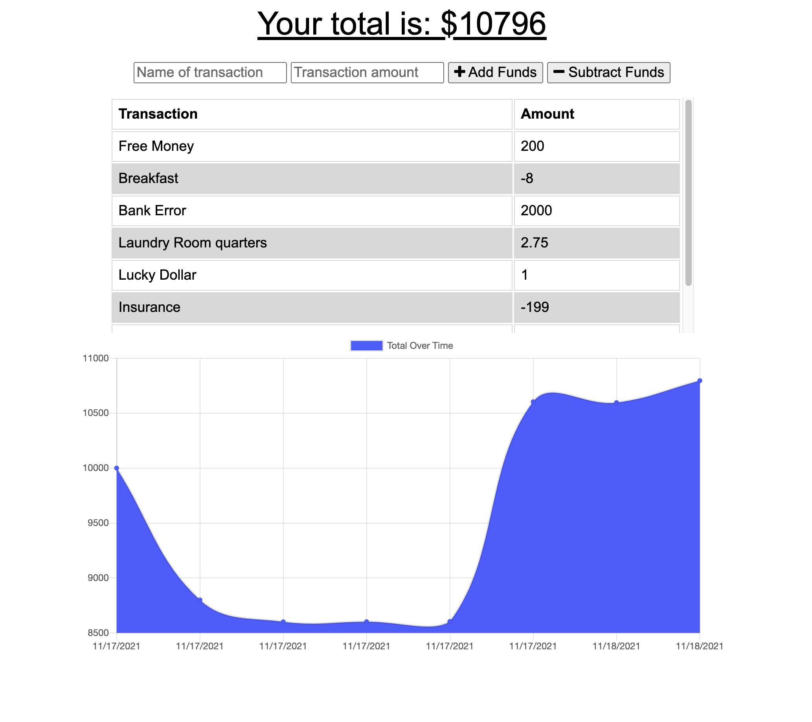

# Budget Tracker
Budget Track is a simple application to track day-to-day cash influx and output to make sure you stay on your budget. Understand you always need to know where you stand with your budget, this progressive web application is available offline and to download directly on your smartphone.

## Summary
[Click here to use the Budget Tracker application.](https://budget-tracker-211115.herokuapp.com/)

* Users are able to keep track of their daily expenses in the context of their total budget.
* Users can add expenses and deposits which immediately adjust their total available budget and the dynamic graph showing their total over time.
* Each transaction is recorded in a list so that a user can review all expenditures/gains over a set amount of time to see exactly where there money is going to and coming from.
* The Budget Tracker application supports offline access and functionality without any loss of data.
  * Users can add expenses and deposits with or without a connection and see the item immediately added to their list of transactions and reflect in the graph.
  * Any transactions added while offline will populate the total when brought back online.

### App Interface

### Adding Transactions

### Offline Use
Any transaction created while the app/browser is offline are cached locally until the app is back online. Once online these records are written the the underlying database and the cache is cleared.

## Installation
Ensure you have Node.js installed locally to install packages to and from the public npm registry. Node.js installation documentation.

1. Clone the repository to your local machine.

2. Install application dependencies `npm install`.
Required when when you first set up the project for local development or use OR if any changes are made to the project's dependencies. More Node information here.

3. From the root folder, add the seed data to your now established database with `npm run seed`

4. Start the application with `npm start` 

5. Open the website in your local browser at http://localhost:3000

## Technologies used
* [Mongo DB](https://www.mongodb.com/) - The NoSQL database used to support record storage.
* [Mongoose](https://www.npmjs.com/package/mongoose) - Mongoose is a MongoDB object modeling tool used for all models in this application.
* [Morgan](https://www.npmjs.com/package/morgan) - HTTP request logger middleware for Node.
* [Node](https://nodejs.org/en/) - Asynchronous event-driven JavaScript runtime environment that executes JavaScript code outside a web browser
* [NPM](https://www.npmjs.com/) - Node package manager, used in conjunction with JS and Inquirer to support application logic and Command Line interface.
* [Expressjs](https://expressjs.com/) - Leveraged for API's, utility methods, and middleware.
* [Compression](https://www.npmjs.com/package/compression) - Middleware for file compression.
* [Lite-server](https://www.npmjs.com/package/lite-server) - Dev-only node server that serves the web app to open it in the browser, refresh it when html or javascript is changed, inject CSS changes using sockets, and has a fallback page if a route is not found.
* [Webpack](https://www.npmjs.com/package/webpack) - Used for bundling modules.
* [Webpack CLI](https://www.npmjs.com/package/webpack-cli) - Provides a flexible set of commands to increase set up speed on a custom webpack project.
* [Webpack-PWA-Manifest](https://www.npmjs.com/package/webpack-pwa-manifest) - Plugin to generates a 'manifest.json' for this PWA.
* [Chart.js](https://www.chartjs.org/) - Javascript charting.
* [Javascript](https://developer.mozilla.org/en-US/docs/Web/javascript) - Core app logic.
* [Bootstrap](https://getbootstrap.com/docs/5.0/getting-started/introduction/) - Style and icon framework.
* [CSS](https://devdocs.io/css/) - Used to style html elements on the page as needed beyond Bootstrap.
* [HTML](https://developer.mozilla.org/en-US/docs/Web/HTML) - Used to create elements on the DOM.
* [Git](https://git-scm.com/doc) - Version control system to track changes to source code.
* [GitHub](https://docs.github.com/en) - Hosts the code repository.

## Author
Sarah Hollingsworth
* [Github](https://github.com/sahhollingsworth)
* [LinkedIn](https://www.linkedin.com/in/sarahhollingsworth/)

## License
* Licensed under the [MIT](https://opensource.org/licenses/MIT) license.